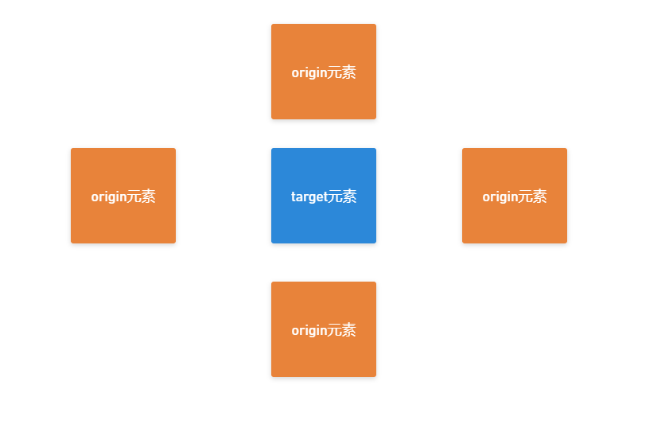

## 羊了个羊实现
[立即体验](http://121.5.230.70:8080/ylgy/)

### 1、为什么要做羊了个羊？

最近非常火的小游戏，莫过于“羊了个羊”吧；我记得第二关难得不像话，以至于上了好几拨微博热搜；我也跟着试玩了几把，觉得挺有意思了，就想着自己实现一个自己的“羊了个羊”

### 2、功能分析

* 1、羊了个羊 消除方式是 3个一消除，所以**我们生成的block个数应为 3的倍数**

* 2、每个block在页面上的位置都是随机的

* 3、关于block元素层级的问题：

   由于我们采用的是“绝对定位”布局，并且渲染的顺序是通过生成数据的顺序来渲染的，所以，**如果元素发生覆盖的话，那么一定是后面的元素覆盖前面的；**

  比如： **我们查看第3个元素是否被覆盖，那么我们只需要找到3后面的元素（4、5、6 ...），看是否覆盖了3元素**

* 4、如何当前判断元素是否被覆盖？

  由上面可知道，检查元素target是否被覆盖，我们只需要，找到当前元素后面的所有元素；只要有一个覆盖了当前target元素，那么当前元素就是被覆盖了

  **那么如何判断两个元素被覆盖呢？**

  

  

如上图：元素不覆盖的四种情况：

	 * 1、origin的左边 大于 target的右边
	 * 2、origin的右边 小于 target的左边
	 * 3、origin的下边 小于 target的上边
	 * 4、origin的上边 大于 target的下边

这四种情况都不满足就可以判断两个元素发生重叠

* 5、点击元素移动到控制栏中

  * 5.1、控制栏中元素插入规则：

    * 5.1.1、控制栏中没有block元素时：**将block元素放到第一位**

      如： []  中插入 "牛",   则插入之后的结果  ["牛"]

    * 5.1.1、控制栏中前面有相同的block元素：**插入到最后一个相同的block元素的后面**

      如： [牛, 龙，龙, 蛇, 兔]  中插入 "龙",   则插入之后的结果  [牛, 龙，龙,  "龙", 蛇, 兔]

    * 5.1.2、控制栏中前面没有相同的block元素：**插入到最后一个block后面**

      如： [牛, 龙, 蛇, 兔]  中插入 "虎",   则插入之后的结果  [牛, 龙, 蛇, 兔, "虎"]

  * 5.2、元素插入时动画

    分析方案： 

    1、使用绝对定位

    我们计算出元素插入的位置，给设置到点击元素上，并加上动画效果

    缺点：当我们插入到某个控制子元素之前时，需要插入位置后面的元素都要移动一个位置之后再插入，这样增加了工作量

    2、克隆元素、并将元素插入到控制栏中

    * 点击元素时，克隆此点击的元素、并将一些样式设置为初始状态
    * 将克隆的元素插入到控制栏中
    * 动画效果的话，使用[**Flip动画技术**](http://121.5.230.70/article/41)；

    

    > Flip动画技术思路：
    >
    > 点击**目标元素**、并记录目标元素的坐标和克隆此元素
    >
    > 将**克隆元素**插入到控制栏中、并记录插入之后的坐标
    >
    > 对比插入前后两个坐标之间的差值，将差值设置到**克隆元素**通过`translate`偏移到点击元素的位置
    >
    > 删除点击的目标元素 （此时我们在点击的位置看到的元素时**克隆元素**，并且它已经插入到控制栏中了）
    >
    > ===============================================================
    >
    > 利用**事件循环的宏任务**（保证上面的dom操作已经渲染到浏览器中了）
    >
    > 将**克隆元素translate**属性设置为`none`、并设置过渡动画 `transition`
    >
    > 这样我们点击的元素就有动画的效果

* 6、消除元素 和 结束程序

  每次点击元素且后，

  ​	判断控制栏中是否存在大于或3个相同的元素？

  ​		存在：就取出3个相同的子元素删除

  ​	判断消除之后的所有元素个数是否大于或等于7？

  ​		是： 游戏结束、挑战失败

  ​	判断所有block元素是否为空？

  ​		是：游戏结束、挑战成功


### 3、基本功能实现

#### 3.1、生成随机要展示的数据

```js
const originSources = {
    '鼠': '#FF7F24',
    '牛': '#FF1493' ,
    '虎': '#C6E2FF',
    '兔': '#98FB98',
    '龙': '#836FFF',
    '蛇': '#00CD00'
}

this.sources = Object.keys(originSources).reduce((acc, source) => {
    // 每个数据生成6个
    for (let i = 0; i < 3 * 2 ; i++) {
        acc.push(source)
    }
    return acc
}, [])
```

#### 3.2、创建子节点并且渲染到指定位置

* 封装获取随机位置

```js
function getRandomPosition () {
    const { contentWidth, contentHeight, width, height } = this.options
    const left = Math.floor(Math.random() * (contentWidth - width))
    const top = Math.floor(Math.random() * (contentHeight - height))
    return {
        left,
        top
    }
}
```

生成子元素，并设置执行样式

```js
function render () {
		const { width, height, color, content, index, contentEl } = this.options
		// 1、创建block div
		this.el = document.createElement('div')
		// 2、填充内容及上色
		this.el.innerText = content
		// 3、设置block的位置
		const { left, top } = this.getRandomPosition()
		this.el.setAttribute('style', `position: absolute; width: ${width}px; height: ${height}px; background: ${color}; color: #fff; left: ${left}px; top: ${top}px; display: flex; justify-content: center; align-items: center; cursor: pointer;`)
		this.el.setAttribute('data-index', index)
		this.el.setAttribute('class', 'ylgy-item')
		// 4、渲染到页面上
		contentEl.appendChild(this.el)
	}
```

#### 3.3、判断当前元素是否被覆盖

根据上面的需求分析，我们可以封装两个函数：

```js
/**
	 * 比较el2是否覆盖了el1 ？
	 * 比较思路：
	 * 不覆盖的四种情况：
	 * 1、el2左边 大于 el1的右边
	 * 2、el2的右边 小于 el1的左边
	 * 3、el2的下边 小于 el1的上边
	 * 4、el2的上边 大于 el1的下边
	 * 
	 * 当不满足上面所有的情况，那就判定 el2 覆盖了 el1
	 * */
function compareElCover (el1, el2) {
    // 获取元素的位置数据
    function getPositionData (el) {
        const left = el.offsetLeft
        const top = el.offsetTop
        const right = left + el.offsetWidth
        const bottom = top + el.offsetHeight
        return {
            left,
            top,
            right,
            bottom
        } 
    }
    const { left: left1, top: top1, right: right1, bottom: bottom1 } = getPositionData(el1)
    const { left: left2, top: top2, right: right2, bottom: bottom2 } = getPositionData(el2)
    // 不覆盖的情况
    const result = left2 > right1 || right2 < left1 || bottom2 < top1 ||top2 > bottom1
    return !result
}
```

```js
/*
判断是否被覆盖 
els 是 this.el 后面的所有的元素数组
*/ 
{
   isCover (els) {
    // 去到当前元素的索引，比如是3，那么我们就去找4,5,6...的元素看是否覆盖到当前元素上面
        // 因为渲染的话是依次进行渲染的，在3前面的元素一定不会覆盖3这个元素
        // this.compareElCover(this.el)
        return els.some(el => {
            if (!el) return false
            return this.compareElCover(this.el, el)
        })

    } 
}
```

#### 3.4、将点击元素插入到指定位置

* 查找控制槽内的相同元素的索引

````js
function findSameBlockIndex (el) {
    // 控制槽内的所有子元素
    const els = Array.from(this.el.children)
    const elLength = els.length
    let index = -2

    // 倒叙查找相同内容的元素
    for (let i = els.length - 1; i >= 0; i--) {
        const checkContent = els[i].innerText
        // 查找到之后结束循环
        if (checkContent === el.innerText) {
            index = i
            break;
        }
    }
    const nextIndex = (index + 1) >= elLength ? -1 : (index + 1)
    return nextIndex
}
````

* 将点击元素插入到控制槽中，并使用Flip动画技术实现动画

```js
// 克隆点击的元素
const contralChildEl = target.cloneNode(true)

// 将克隆元素插入到 控制槽中（插槽中存在元素，则插入到最后一个元素的后面；没有此元素则插入到最后）
const index = contralBox.findSameBlockIndex(target)
if (index >= 0) {
    contralBox.el.insertBefore(contralChildEl, contralBox.el.children[index])
} else {
    contralBox.el.appendChild(contralChildEl)
}
// 在移除元素之前，先获取元素相对于浏览器的坐标
const targetRact = target.getBoundingClientRect()
// 移除点击元素
target.parentNode.removeChild(target)
const originRact = contralChildEl.getBoundingClientRect()
// 计算插槽中的元素相对于点击元素的 纵横偏移量
const x = originRact.left - targetRact.left
const y = originRact.top - targetRact.top
// 将插入的元素偏移到点击元素位置（dom位置发生了改变、此时浏览器还未进行渲染，所以我们看不到偏移的过程）
contralChildEl.style.transform = `translate(${-x}px, ${-y}px)`


// 利用宏任务，让过渡动画在浏览器渲染之后执行
setTimeout(() => {
    // 每次点击之后都要重新计算下元素覆盖情况
    this.checkCover()
    contralChildEl.style.transition = 'all .3s'
    contralChildEl.style.transform = 'none'
    
})
```

### 4、完整实现

我们将整体分为3部分：

* 1、最外层容器部分 `Ylgy`
  * 负责初 始化根容器、生成渲染数据
* 2、每个子元素部分 Block
  * 负责 生成随机位置并渲染子元素
  * 判断 当前子元素是否被覆盖
* 3、底部控制栏部分 ContralBox
  * 负责 渲染控制槽部分
  * 查找槽内是否有相同的元素
  * 每 3个元素组成一组并移除
  * 检查游戏结果（成功/失败）

#### 4.1、封装Block构造函数

```js
class Block {
	constructor (options) {
		this.options = options
		this.render()
	}

	// 渲染子节点
	render () {
		const { width, height, color, content, index, contentEl } = this.options
		// 1、创建block div
		this.el = document.createElement('div')
		// 2、填充内容及上色
		this.el.innerText = content
		// 3、设置block的位置
		const { left, top } = this.getRandomPosition()
		this.el.setAttribute('style', `position: absolute; width: ${width}px; height: ${height}px; background: ${color}; color: #fff; left: ${left}px; top: ${top}px; display: flex; justify-content: center; align-items: center; cursor: pointer;`)
		this.el.setAttribute('data-index', index)
		this.el.setAttribute('class', 'ylgy-item')
		// 4、渲染到页面上
		contentEl.appendChild(this.el)
	}

	// 随机生成当前模块的位置
	getRandomPosition () {
		const { contentWidth, contentHeight, width, height } = this.options
		const left = Math.floor(Math.random() * (contentWidth - width))
		const top = Math.floor(Math.random() * (contentHeight - height))
		return {
			left,
			top
		}
	}
	// 判断是否被覆盖
	isCover (els) {
		// 去到当前元素的索引，比如是3，那么我们就去找4,5,6...的元素看是否覆盖到当前元素上面
		// 因为渲染的话是依次进行渲染的，在3前面的元素一定不会覆盖3这个元素
		// this.compareElCover(this.el)
		return els.some(el => {
			if (!el) return false
			return this.compareElCover(this.el, el)
		})

	}

	/**
	 * 比较el2是否覆盖了el1 ？
	 * 比较思路：
	 * 不覆盖的四种情况：
	 * 1、el2左边 大于 el1的右边
	 * 2、el2的右边 小于 el1的左边
	 * 3、el2的下边 小于 el1的上边
	 * 4、el2的上边 大于 el1的下边
	 * 
	 * 当不满足上面所有的情况，那就判定 el2 覆盖了 el1
	 * */
	compareElCover (el1, el2) {
		// 获取元素的位置数据
		function getPositionData (el) {
			const left = el.offsetLeft
			const top = el.offsetTop
			const right = left + el.offsetWidth
			const bottom = top + el.offsetHeight
			return {
				left,
				top,
				right,
				bottom
			} 
		}
		const { left: left1, top: top1, right: right1, bottom: bottom1 } = getPositionData(el1)
		const { left: left2, top: top2, right: right2, bottom: bottom2 } = getPositionData(el2)
		// 不覆盖的情况
		const result = left2 > right1 || right2 < left1 || bottom2 < top1 ||top2 > bottom1
		return !result
	}
}
```

#### 4.2、封装ContralBox构造函数

```js
/**
 * 底部控制栏构造函数
 * width: 父元素的宽度，
 * height： 高度
 * parentEl: ylgy根节点
 * source: 初始化渲染数据 （目的是为了移除元素的时候将对应的元素给设置为null）
 * */
class ContralBox {
	constructor (options) {
		this.options = options
		this.render()
	}

	// 渲染函数, 将元素渲染到页面上
	render () {
		const el = document.createElement('div')
		const blockWidth = this.options.width / 6
		const blockHeight = this.options.height / 6
		el.setAttribute('style', `display: flex; border: 1px solid #ccc; position: absolute; left: -${blockWidth / 2}px; bottom: -${blockWidth + 20}px; width: ${blockWidth * 7}px; height: ${blockHeight}px`)
		this.options.parentEl.appendChild(el)
		this.el = el
	}

	// 查找控制槽内的相同元素的索引
	findSameBlockIndex (el) {
		const els = Array.from(this.el.children)
		const elLength = els.length
		let index = -2
		
		// 倒叙查找相同内容的元素
		for (let i = els.length - 1; i >= 0; i--) {
			const checkContent = els[i].innerText
			// 查找到之后结束循环
			if (checkContent === el.innerText) {
				index = i
				break;
			}
		}
		const nextIndex = (index + 1) >= elLength ? -1 : (index + 1)
		return nextIndex
	}

	// 移除3个相同的元素
	removeTeam () {
		const childs = Array.from(this.el.children)
		// 筛选出所有种类的个数,以及每个种类的索引
		const map = childs.reduce((acc, childEl, index) => {
			const key = childEl.innerText
			if (acc[key]) {
				const indexs = acc[key].indexs
				indexs.push(index)
				acc[key] = {
					count: acc[key].count + 1,
					indexs
				}
			} else {
				acc[key] = {
					count: 1,
					indexs: [index]
				}
			}
			return acc
		}, {})
		// 查找种类个数为3的元素，并移除
		for (let [key, { count, indexs }] of Object.entries(map)) {
			if (count >= 3) {
				indexs.slice(0, 3).forEach(i => {
					// 移除元素
					childs[i].parentNode.removeChild(childs[i])
					
				})
			}
		}
		// 检查结果
		setTimeout(() => {
			this.checkResult()
		})
	}

	// 检查结果
	checkResult () {
		// 检查是否挑战失败
		if (this.el.children.length >= 7) {
			 alert('挑战失败')
			return window.location.reload()
		}
		// 检查是否挑战成功
		const ylgyItems = this.options.parentEl.querySelectorAll('.ylgy-item')
		if (ylgyItems.length <= 0) {
			 alert('恭喜您挑战成功！')
			 return window.location.reload()
		}
	}
} 

```

#### 4.3、封装Ylgy构造函数

```js
class Ylgy {

	constructor ({ el, width = 300, height = 300, originSources }) {
		const baseSources = {
			'鼠': '#FF7F24',
			'牛': '#FF1493' ,
			'虎': '#C6E2FF',
			'兔': '#98FB98',
			'龙': '#836FFF',
			'蛇': '#00CD00'
		}
		this.options = {
			el,
			width,
			height,
			originSources: originSources || baseSources
		}
		// 渲染数据 ['鼠', '兔', '牛', ...]
		this.sources = []
		// 每个元素对应的block实例
		this.sourceBlocks = []
		// 底部控制栏实例
		this.contralBox = null

		
		// 初始化数据，生成要渲染的数据
		this.initSources(this.options.originSources)
		// 在页面上绘制基础盒子大小，以及绘制底部控制栏
		this.initBox()
		// 初始化子元素
		this.initItems()
		
		// 通过事件代理绑定点击事件
		this.bindEvent()
	}
	// 初始化源数据
	initSources (originSources) {
		this.sources = Object.keys(originSources).reduce((acc, source) => {
			for (let i = 0; i < 3 * 2 ; i++) {
				acc.push(source)
			}
			return acc
		}, [])
		// this.sources.sort(() => Math.random() - 0.5)
	}
	// 初始化子元素
	initBlocks () {
		// 先清空所有元素
		this.cleanAllItems()
		this.sourceBlocks = []
		this.sources.forEach((source, index) => {
			let block = null
			if (source) {
				block = new Block({
					width: this.options.width / 6,
					height: this.options.height / 6,
					content: source,
					color: this.options.originSources[source],
					contentWidth: this.options.width,
					contentHeight: this.options.height,
					contentEl: this.options.el,
					index
				})
			}
			this.sourceBlocks.push(block)
		})
	}
	// 校验覆盖
	checkCover () {
		this.sourceBlocks.forEach(block => {
			if (block) {
				const index = Number(block.el.dataset.index)
				// 截取需要比对的元素列表
				const compareEls = this.sourceBlocks.slice(index + 1).map(block => block ? block.el: block)
				// 判断当前元素是否被覆盖
				const isCover = block.isCover(compareEls)
				if (isCover) {
					block.el.classList.add('cover')
				} else {
					block.el.classList.remove('cover')
				}
			}

		})
	}
	// 初始化核心容器
	initBox () {
		const { el, width, height } = this.options
		el.style.width = width + 'px'
		el.style.height = height + 'px'
		// 设置底部容器条

		// 将实例挂在到this上
		this.contralBox = new ContralBox({
			width,
			height,
			parentEl:el,
			sources: this.sources
		})
	}
	// 绑定点击事件
	bindEvent () {
		this.options.el.addEventListener('click', (event) => {
			const target = event.target
			const { contralBox } = this
			// 点击符合条件的元素
			if (target.classList.contains('ylgy-item') && !target.classList.contains('cover')) {
				console.log(this.sources)
				// 克隆点击的元素
				const contralChildEl = target.cloneNode(true)
				// 覆盖克隆元素的一些样式值
				contralChildEl.style.position = 'static'
				contralChildEl.style.left = 'initial'
				contralChildEl.style.left = 'top'
				contralChildEl.style.zIndex = '1'
				contralChildEl.classList.remove('ylgy-item')
				contralChildEl.classList.add('ylgy-contral-item')

				// 将克隆元素插入到 控制槽中（插槽中存在元素，则插入到最后一个元素的后面；没有此元素则插入到最后）
				const index = contralBox.findSameBlockIndex(target)
				if (index >= 0) {
					contralBox.el.insertBefore(contralChildEl, contralBox.el.children[index])
				} else {
					contralBox.el.appendChild(contralChildEl)
				}
				// 在移除元素之前，先获取元素相对于浏览器的坐标
				const targetRact = target.getBoundingClientRect()
				// 移除点击元素
				target.parentNode.removeChild(target)
				const originRact = contralChildEl.getBoundingClientRect()
				// 计算插槽中的元素相对于点击元素的 纵横偏移量
				const x = originRact.left - targetRact.left
				const y = originRact.top - targetRact.top
				// 将插入的元素偏移到点击元素位置（dom位置发生了改变、此时浏览器还未进行渲染，所以我们看不到偏移的过程）
				contralChildEl.style.transform = `translate(${-x}px, ${-y}px)`

				// 获取移除sources的渲染索引，并将source指定的索引的元素赋值为null， 避免刷新的时候通过sources的时候重新添加
				const i = Number(contralChildEl.dataset.index)
				this.sources[i] = null

				// 利用宏任务，让过渡动画在浏览器渲染之后执行
				setTimeout(() => {
					// 每次点击之后都要重新计算下元素覆盖情况
					this.checkCover()
					contralChildEl.style.transition = 'all .3s'
					contralChildEl.style.transform = 'none'
					setTimeout(() => {
						contralBox.removeTeam()
					}, 350)
				})
			}
		})
	}

	// 清空所有的子元素
	cleanAllItems () {
		const els = Array.from(this.options.el.querySelectorAll('.ylgy-item'))
		els.forEach(el => el.parentNode.removeChild(el))
	}

	// 初始化item
	initItems () {
		this.sources.sort(() => Math.random() - 0.5)
		console.log(this.sources)
		const a = this.sources.reduce((acc, one) =>{
			if (acc[one]) {
				acc[one] = acc[one] + 1
			} else {
				acc[one] = 1
			}
			return acc
		}, {})
		console.log('aa', a)
		// 根据渲染数据生成对应的元素
		this.initBlocks()
		// 校验元素是否被覆盖，给覆盖的元素添加上遮罩层
		this.checkCover()
	}
}
```


### 5、完整代码测试

```html
<!DOCTYPE html>
<html>
<head>
	<meta charset="utf-8">
	<meta name="viewport" content="width=device-width, initial-scale=1">
	<title>羊了个羊</title>
	<style type="text/css">
		* {
			padding: 0;
			margin:  0;
			box-sizing: border-box;
		}
		.app {
			display: flex;
			align-items: center;
			justify-content: center;
		}
		#ylgy {
			border: 1px solid #ccc;
			margin-top:  20px;
			position: relative;

		}
		.cover::after {
			content: '';
			position: absolute;
			left: 0;
			top: 0;
			right: 0;
			bottom: 0;
			background: rgba(0,0,0,.4);
		}

		#reload {
			padding: 6px 12px;
			background-color: #3366ff;
			color: #fff;
			border: none;
			cursor: pointer	;
			margin-left: 10px;
			border-radius: 3px;

		}
		#reload:active {
			background-color: #3333ff;
		}
	</style>
</head>
<body>
	<div class="app">
		<div id="ylgy">
			
		</div>
		<button id="reload">刷新</button>
	</div>
	<script type="module" type="module">
		import Ylgy from './index.js'
		const ylgy = new Ylgy({
			el: document.querySelector('#ylgy'),
			width: 350,
			height: 350
		})

		document.querySelector('#reload').addEventListener('click', () => {
			ylgy.initItems()
		})
		console.log(ylgy)
	</script>
</body>
</html>
```

